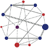

# DGGS Geometry Validator
A Python library and command line utility that validates Discrete Global Grid Systems (DGGS) geometry literals in one of several formats, such as DGGS [Well-Known Text](https://en.wikipedia.org/wiki/Well-known_text_representation_of_geometry), DGGS [GeoJSON](https://tools.ietf.org/html/rfc7946), and DGGS [GML](https://www.ogc.org/standards/gml).


## NOTE: currently only the normal - non-DGGS - WKT is validatable for code testing only


## Installation
This is a Python utility that is available via the Python Package Index, PyPI at <https://pypi.org/project/wktdggs/> so it may be installed using the PIP program:

(Using the Python3 pip installer `pip3`)
```
$ pip3 install dggsgv
```

Or in a python virtualenv _(these example commandline instructions are for a Linux/Unix based OS)_

```bash
python3 -m venv venv
source venv/bin/activate
pip install pyshacl
```

You can also install it locally by downloading or cloning, using [Git](https://git-scm.com) the source files from its [GitHub](https://github.com/) repository at <https://github.com/surroundaustralia/dggsgv>. After cloning / downloading navigate into the package's main  directory that contains the `setup.py` file. Then, install it locally like this:

```
python setup.py install
```


## Use
### As a Python Library
To use the utility as a Python library, import it into your Python code and call the `validate` function, something like this:

```python
from dggsgv import validate

# the WKT DGGS literal I want to validate
geom = "<http://w3id.org/dggs/tb16pix> POINT (P123456)"

vresult = validate(geom)

if vresult[0]:
    print("It is valid!")
else:
    print("It is not valid.")
    print("The validation errors are:")
    print("\n".join(vresult[1]))  # all messages are in a list within vresult[1] 
```

### As a command line tool
Use Python to call the command line script `cli.py` within the package like this:

```bash
python cli.py [-h] STRING_OR_FILE_PATH [-o {table,json}]

positional arguments:
    STRING_OR_FILE_PATH: a geometry literal value or the path of a file containing 
                         geometry literals, one per line

optional arguments:
    -h, --help          show this help message and exit
    -o, --output:       the value 'table' or 'json' to return a formatted text table
                        of results or JSON
```

If you have installed the package, you can call it on the command line like this (UNIX or Linux or Mac):

```bash
dggsgv STRING_OR_FILE_PATH [-o {table,json}]
```


You can present the `cli.py`/`dggsgv` script with geometry literal values in string, e.g., for a WKT value:

```bash
dggsgv "<http://w3id.org/dggs/tb16pix> POINT (P123456)"
```

or you can give it a file to read:

```bash
dggsgv /path/to/my/file.txt
```

If giving it a file, it will look for one WKT DGGS geometry per line and validate each. It will report its results with a line number if more than one line is present in the file, e.g.:

```
Line    Valid   Messages
---     ---     ---
1       True    -
2       True    -
3       False   The Geometry Type provided is not valid. 
                It must be one of: POINT, MULTIPOINT, LINESTRING, 
                MULTILINESTRING, POLYGON, MULTIPOLYGON, 
                GEOMETRYCOLLECTION
...             
N       True    -   
```

You can also return a JSON format, e.g. for geometries in a file called `geometries.txt`:

```bash
dggsgv /path/to/my/geometries.txt -o json
```


## License  
This code is licensed using the LGPL v3 licence. See the [LICENSE file](LICENSE) for the deed. 

Note [Citation](#citation) below for attribution.


## Citation
To cite this software, please use the following BibTex:

```
@software{wktdggs,
  author = {{Nicholas J. Car}},
  title = {WKT for DGGS validator},
  version = {0.5},
  date = {2020},
  publisher = "SURROUND Australia Pty. Ltd.",
  url = {https://data.surroundaustralia.com/software/wktdggs}
}
```

Or the following RDF:

```
@prefix dcterms: <http://purl.org/dc/terms/> .
@prefix owl: <http://www.w3.org/2002/07/owl#> .
@prefix sdo: <https://schema.org/> .
@prefix wiki: <https://www.wikidata.org/wiki/> .
@prefix xsd: <http://www.w3.org/2001/XMLSchema#> .

<https://data.surroundaustralia.com/software/wktdggs>
    a sdo:SoftwareSourceCode , owl:NamedIndividual ;
    sdo:codeRepository <https://github.com/surroundaustralia/wktdggs> ;
    dcterms:type wiki:Q7397 ; # "software"
    dcterms:creator "Nicholas J. Car" ;
    dcterms:date "2020"^^xsd:gYear ;
    dcterms:title "WKT for DGGS validator" ;
    sdo:version "0.1" ;
    dcterms:publisher [
        a sdo:Organization ;
        sdo:name "SURROUND Pty Ltd" ;
        sdo:url <https://surroundaustralia.com> ;
    ]
.
```


## Contacts

*publisher:*  
  
**SURROUND Australia Pty. Ltd.**  
<https://surroundaustralia.com>  

*creator:*  
**Dr Nicholas J. Car**  
*Data Systems Architect*  
SURROUND Australia Pty. Ltd.  
<nicholas.car@surroudaustralia.com>  
<https://orcid.org/0000-0002-8742-7730>  
